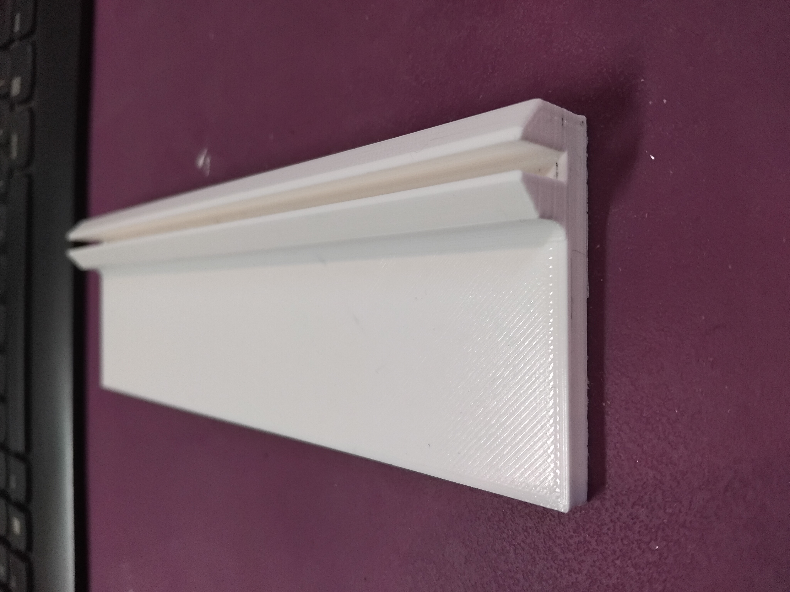
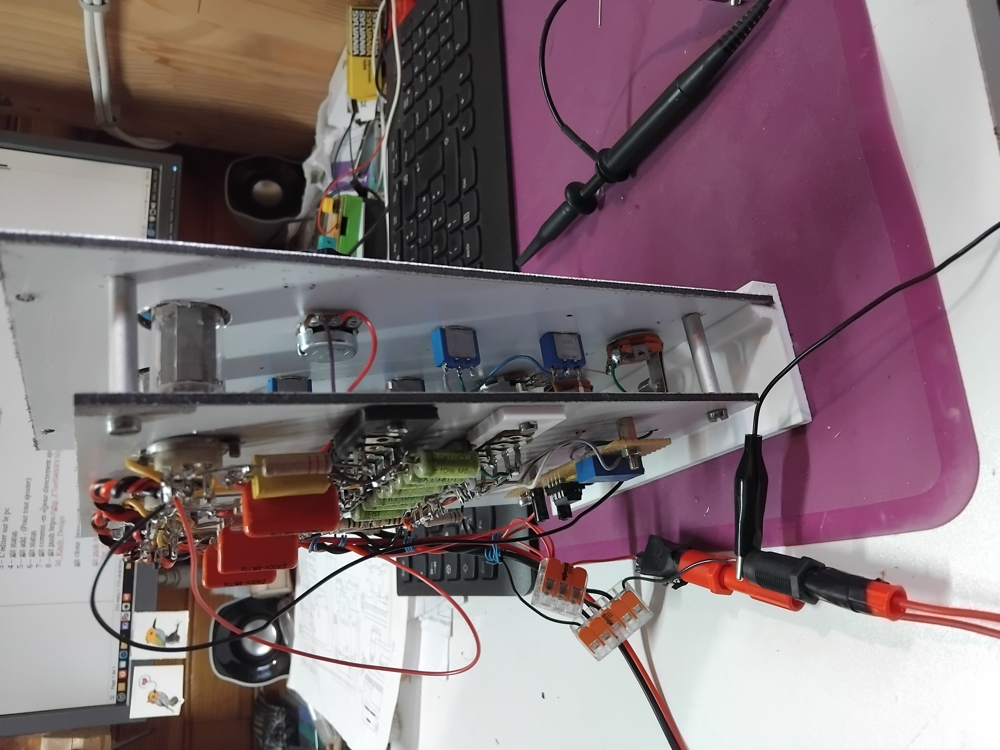
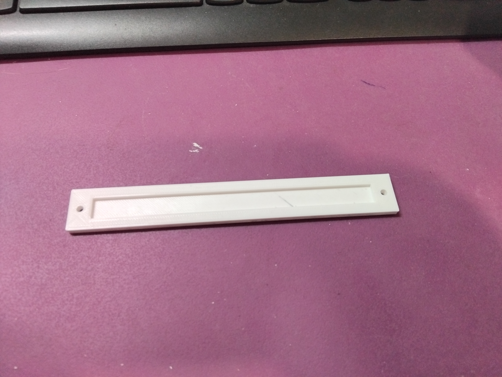
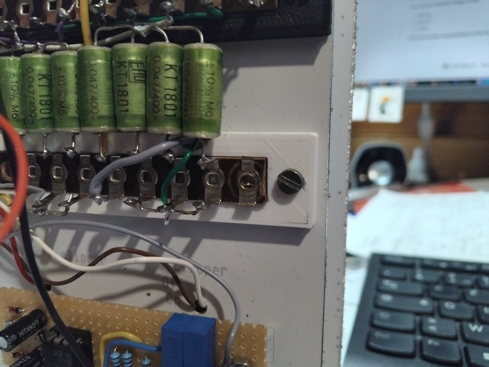
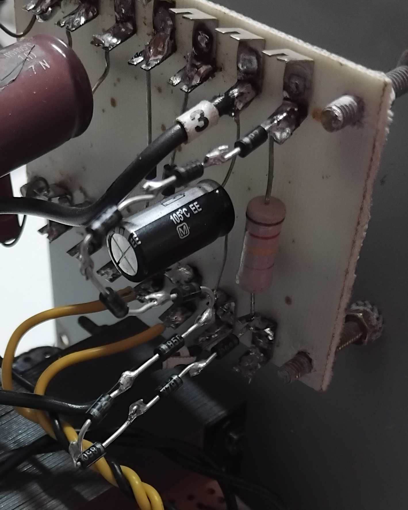
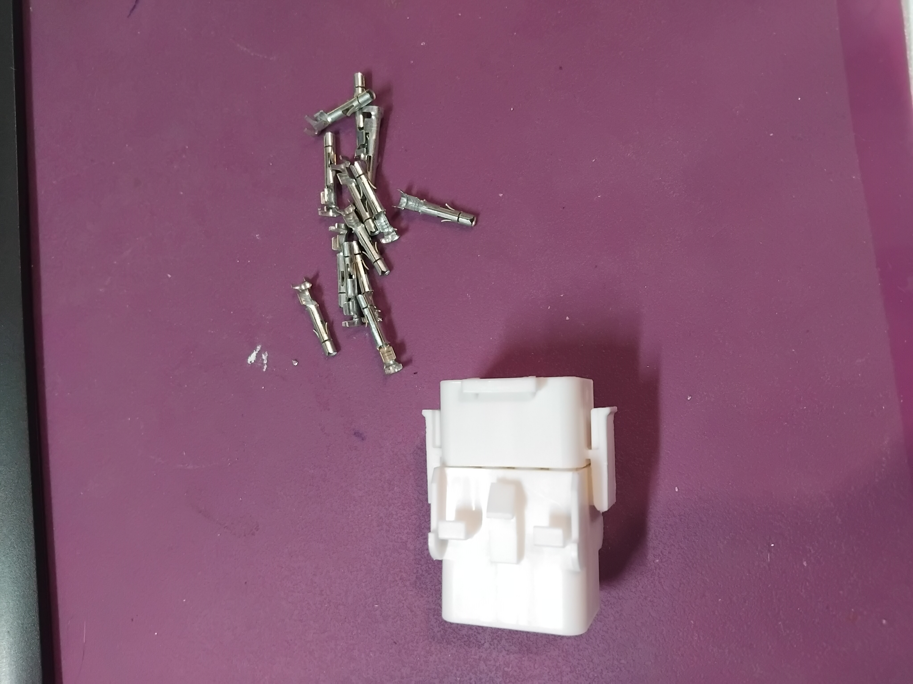
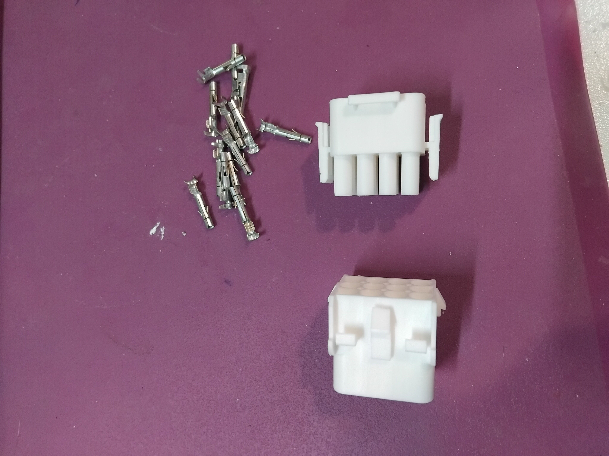
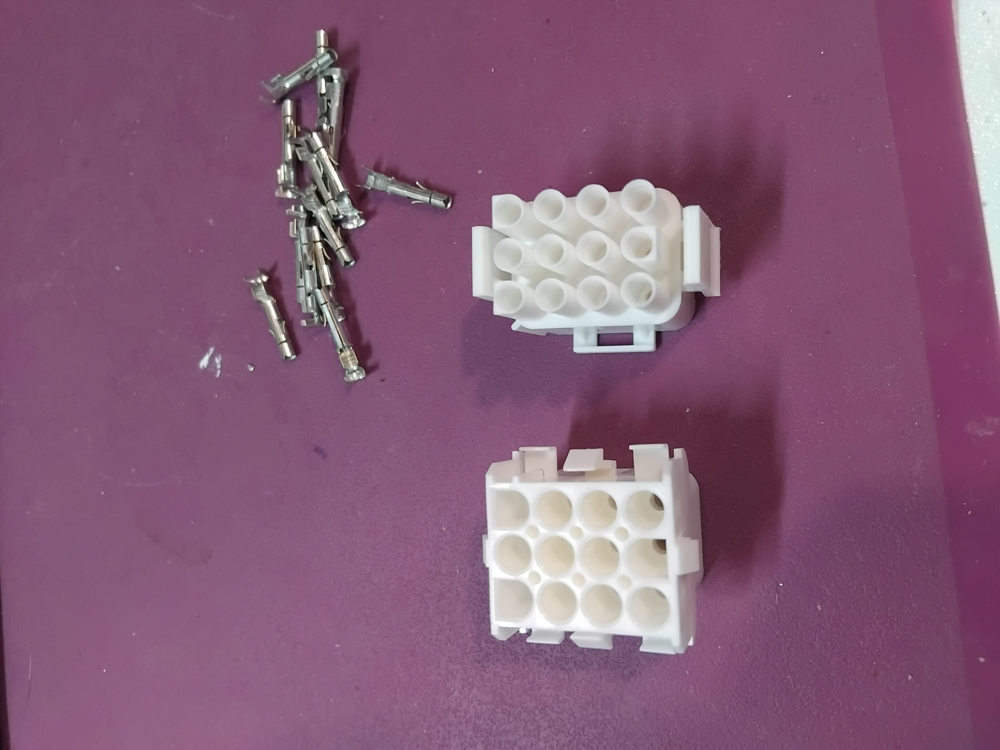

# Tube Synth - How to

The first one !! 
Whoooooohooooo :)

I'll describe my journey of tube's noob :)

You'll find here my work in progress like a prototype devloppment.

##Maquette

My friend wanted to get an idea of what it would look like.
I made a mock-up front panel and decided on a position for the tube. Wood, hot glue...

Quick and dirty :)

We agreed that it was a feasible project.

##prototype V0.1 using Dibond.

Paper stuck on the dibond to see what it look like.

A reliable/strong support for the tubes is needed, they don't have to move. I used another dibond for the tube sockets.

I thought that if i add a second support I would have enough space to place the components.

Even with a lot of otimism i realized that there wouldn't be enough space to make a clean assembly, 

Ok, I'll opted for a rear panel to have enough space to put everything in neatly.
It will hold the tube holders, all the components, and the connection strips.

Side view

Empty rear panel

Full rear panel

Front panel

To hold the module vertically, i draw a support : Files/Support

## 1 - Choices : 

Tube modules take up space because everything is bulkier. In addition to the tubes, best practice dictates that you use 1W resistors, 400V capacitors, and thick wires :)

Very often, tube amplifiers do not use PCBs, but rather a direct connection between the components and the tube holder.

Some people be meticulous with regard to the wiring.
With well-designed wiring, you can read the diagram live, making troubleshooting much easier.

To have a well done wiring we'll be using terminal strips for the tubes, making direct connections between tubes and components, not PCBs, but wire on the fly from component to component.

Some holes placed just above the potentiometers, jacks, and switches will allow the wires from these elements to be routed to the back panel.

--> /!\ WARNING /!\ <--

If you'll use dibond and terminal strip, you HAVE TO isolate the terminal and the dibond !!!!!!
At the beginning i didn't though about that, but it's a VERY BIG mistake, SHORT CIRCUIT !!!!!

I did a 3d Part for this, you'll find it in the files/Insulator

## 2 - Front et Back panel : 

Want to make your own front panel ? : https://github.com/dubhalley/Front_Panel

You'll find them at Files/Panels

Front panel : 

Rear panel : 

Define the position of your jacks, pots, switches, tubes, etc.

Try to keep in mind what each component is connected to in order to optimize the wiring.

There will be visible screws on the front panel to secure the rear panel in parallel with spacers.

I used the .svg file from the front panel to make the rear panel, just reduce the size of 5mm each side because it's become easier to fit with his friends, so I have all my hole positions exactly right ;) 

## 3 - Schéma : 

I used this diagram :

I redid it with Kicad, trying to anticipate the wiring.

Kicad diagram :

But, looking back, I think I could have done better...
I followed the original diagram too closely.
It's the first one ... beginner errors :)
Next time I'll do better ... ;)

I created an .svg file with the component footprints to anticipate the wiring.

Rear panel wiring in theory :

Full wired rear panel in practice :

## 4 - Knob : 

Want to make your own knob ? : https://github.com/dubhalley/Knob

You'll find at Files/Knob

For the knobs, I made a small improvement by digging a small recess on the top, so I can put a colored washer in it to get a position slider.

Knob : Bouton Tube V5.FCStd

Hat : Rond de bouton.FCStd

## 5 - Case : 

Want to make your own case ? : https://github.com/dubhalley/Case

## 6 - Power supply : 

The master piece that makes the whole system work is the power supply. The one we're going to use comes from an old tube oscilloscope.

Here you'll see the finale power supply for the modular, because it's a powerful one :

There will be 3 differents voltage at least :
* 150V DC
* 6.3V AC
* +/-15V
* GND

I'll be sure to make a documentation to find the right voltages with this kind of material. :)

But, for the tests it's easier to check each prototype with a simpler (and lighter) power supply.
It's also come from an old tube oscilloscope, but it's a small one.

This one supply 300V DC (Few Amp) with the left connectors, and 6.3V AC (3A) with the right ones

300V DC ... Hummm it's too high ...
My friend advised me to make a string of Zener diodes.
I used 15V Zener diodes, so by connecting 10 in series, we can reduce the voltage from 150V.

Closer look of the chain

## 7 - Connectors :

To power the modules, we have to choose a connector, ok, there are so many different design.
But, which one is the best one ??

We need : 
- High voltage 150 V DC
- Very high current in 6.3V AC a bit less than 1A per tube to heat the grid (See the datasheet of your tube) (mean 3A for the dual VCO)
- +/-15V for the utility modules
- GND

I found a good one I think, up tu 600V and 20A per position
- lock when close
- you can't put in wrong way
- powerful 
The datasheet : Files/Connector/KAMM12_FT.pdf

## 8 - A module step by step :

- The front and the rear panel
- Drill the holes
- Some aluminium pipe 6mm exteral diameter for the spacer between the two faces (Size it with the lengh of your tubes), and "around" 4 mm int, get mine from the same shop with 2 years between these two dates of buy and with the first one is a 3.8mm inner diameter, and the second is a 4mm. So I'll have to change my screw process... DIY !
- Some nice screws, I choose 4mm diameter 10mm long hexagon socket screw, which is perfect for the first tube, because I directly screw in the spacer.
- Place the tube sockets
- Place the potentiometer with wires
- Place the jack with wire
- Stick the terminal strip with the schematic AND the size of the components in mind
- Use the insulator
- Reproduce the schematic with the components and the wires
- Connector
- Power Up

## 9 - First test

Sorry it's a poor video...
You've too dowload the archive to see it...

I send a low sinus wave from a fonction generator to the CV input, that why the waveform moove.-
